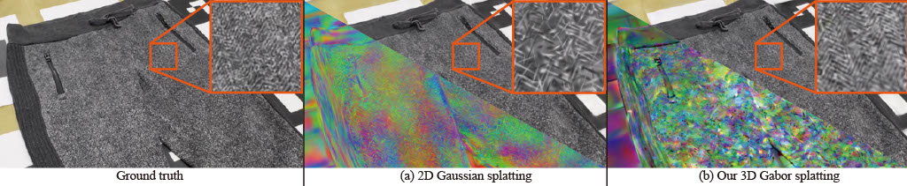

# 3D Gabor Splatting: Reconstruction of High-frequency Surface Texture using Gabor Noise

[Project page](https://haato-w.github.io/3d-gabor-splatting-project-page/) | [Paper](https://arxiv.org/abs/2504.11003) | [Video](https://www.youtube.com/watch?v=ZpBMXtxEEWc) | [Gabor Rasterizer (CUDA)](https://github.com/haato-w/diff-gabor-rasterization) | [Dataset with COLMAP](https://drive.google.com/drive/folders/1M3ZDIQ8cZT3FvqdsX4tDxE0_qLRX8F_9?usp=sharing) <br>



This repo contains the official implementation for the paper "3D Gabor Splatting: Reconstruction of High-frequency Surface Texture using Gabor Noise". Our work represents a scene with a set of augumented Gabor kernels (weigthed sum Gabors). We showed our method can reconstruct high-frequency texture more precisely than 2D Gaussian splatting in our paper. We also published our dataset that have images of scenes having high-frequency texture.

Our work is based on 2D Gaussian splatting. Following statements come from [2DGS repository](https://github.com/hbb1/2d-gaussian-splatting.git). When you want to know features in more detail, please check the repository and paper.

### How to use
```shell
# Starting the training process
python train.py -s <path to COLMAP or NeRF Synthetic dataset> 
# View the trained model
python view.py -s <path to COLMAP or NeRF Synthetic dataset> -m <path to trained model> 
```

## Installation

```bash
# download
git clone https://github.com/haato-w/3d-gabor-splatting.git --recursive

# if you have an environment used for 3dgs, use it
# if not, create a new environment
conda env create --file environment.yml
conda activate gabor_splatting
```
## Training
To train a scene, simply use
```bash
python train.py -s <path to COLMAP or NeRF Synthetic dataset>
```
Commandline arguments for regularizations
```bash
--lambda_normal  # hyperparameter for normal consistency
--lambda_distortion # hyperparameter for depth distortion
--depth_ratio # 0 for mean depth and 1 for median depth, 0 works for most cases
```
**Tips for adjusting the parameters on your own dataset:**
- For unbounded/large scenes, we suggest using mean depth, i.e., ``depth_ratio=0``,  for less "disk-aliasing" artifacts.

## Testing
### Bounded Mesh Extraction
To export a mesh within a bounded volume, simply use
```bash
python render.py -m <path to pre-trained model> -s <path to COLMAP dataset> 
```
Commandline arguments you should adjust accordingly for meshing for bounded TSDF fusion, use
```bash
--depth_ratio # 0 for mean depth and 1 for median depth
--voxel_size # voxel size
--depth_trunc # depth truncation
```
If these arguments are not specified, the script will automatically estimate them using the camera information.
### Unbounded Mesh Extraction
To export a mesh with an arbitrary size, we devised an unbounded TSDF fusion with space contraction and adaptive truncation.
```bash
python render.py -m <path to pre-trained model> -s <path to COLMAP dataset> --mesh_res 1024
```

## Quick Examples
Assuming you have downloaded [MipNeRF360](https://jonbarron.info/mipnerf360/), simply use
```bash
python train.py -s <path to m360>/<garden> -m output/m360/garden
# use our unbounded mesh extraction!!
python render.py -s <path to m360>/<garden> -m output/m360/garden --unbounded --skip_test --skip_train --mesh_res 1024
# or use the bounded mesh extraction if you focus on foreground
python render.py -s <path to m360>/<garden> -m output/m360/garden --skip_test --skip_train --mesh_res 1024
```
If you have downloaded [Our dataset](https://drive.google.com/drive/folders/1M3ZDIQ8cZT3FvqdsX4tDxE0_qLRX8F_9?usp=sharing), you can use
```bash
python train.py -s <path to dataset>/<sweat_pants_full_hd> -m output/sweat_pants_full_hd --resolution 1
python render.py --resolution 1 --skip_test
```
**Custom Dataset**: We use the same COLMAP loader as 3DGS, you can prepare your data following [here](https://github.com/graphdeco-inria/gaussian-splatting?tab=readme-ov-file#processing-your-own-scenes). 

## Full evaluation
You can retrieve the result in the paper following scripts after downloading datasets.
```bash
python train.py -s {colmap_data_full_path} -m {model_path} --eval --resolution 1 --test_iterations 5000 10000 30000 --save_iterations 5000 10000 30000
python render.py -m {model_path} --skip_mesh --resolution 1
python metrics.py -m {model_path}
```

## Acknowledgements
This project is built upon [3DGS](https://github.com/graphdeco-inria/gaussian-splatting) and [2DGS](https://github.com/hbb1/2d-gaussian-splatting.git). We thank all the authors for their great repos. 


## Citation
If you find our code or paper helps, please consider citing:
```bibtex
@inproceedings{watanabe3Dgabors,
      title     = {3D Gabor Splatting: Reconstruction of High-frequency Surface Texture using Gabor Noise},
      author    = {Haato Watanabe, Kenji Tojo and Nobuyuki Umetani},
      publisher = {Eurographics Association}, 
      booktitle = {Proceedings of the Eurographics 2025 Short Papers},
      year      = {2025}
}
```
